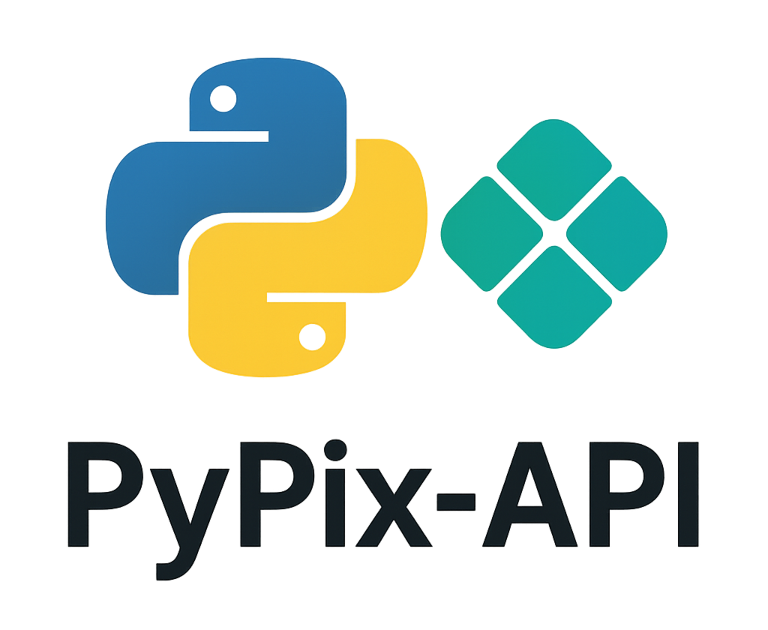

pypix-api Documentation
=======================

Biblioteca em Python para comunicação com APIs bancárias focada na integração com o PIX.

.. image:: https://img.shields.io/pypi/v/pypix-api.svg
   :target: https://pypi.org/project/pypix-api/
   :alt: PyPI version

.. image:: https://img.shields.io/pypi/pyversions/pypix-api.svg
   :target: https://pypi.org/project/pypix-api/
   :alt: Python versions

.. image:: https://github.com/laddertech/pypix-api/workflows/CI%20Pipeline/badge.svg
   :target: https://github.com/laddertech/pypix-api/actions/workflows/ci.yml
   :alt: CI Pipeline

.. image:: https://codecov.io/gh/laddertech/pypix-api/branch/main/graph/badge.svg
   :target: https://codecov.io/gh/laddertech/pypix-api
   :alt: Coverage

Overview
--------

pypix-api é uma biblioteca Python que simplifica a integração com APIs bancárias brasileiras
para operações PIX. Atualmente suporta Banco do Brasil, Sicoob e Sicredi, com planos de
expansão para outros bancos.

**Principais funcionalidades:**

* 🏦 **Bancos suportados**: Banco do Brasil (001), Sicoob (756), Sicredi (748)
* 🔐 **Autenticação**: OAuth2 com mTLS (PEM/PKCS#12) ou HTTP Basic (Sicredi)
* 💰 **PIX**: Cobranças imediatas, com vencimento e em lote
* 🔄 **Recorrência**: Pix Automático (COBR) e gestão de recorrências
* 🪝 **Webhooks**: Configuração e gerenciamento (Pix, COBR, REC)
* 🔍 **Consultas**: PIX, devoluções e locations

Quick Start
-----------

Installation
^^^^^^^^^^^^

.. code-block:: bash

   pip install pypix-api

Basic Usage
^^^^^^^^^^^

.. code-block:: python

   from pypix_api.auth.oauth2 import OAuth2Client
   from pypix_api.banks.bb import BBPixAPI

   # Configure OAuth2 authentication (token_url comes from the bank class)
   oauth_client = OAuth2Client(
       token_url=BBPixAPI.TOKEN_URL,
       client_id='your-client-id',
       cert_pfx='path/to/certificate.pfx',
       pwd_pfx='cert-password',
   )

   # Create PIX API instance
   api = BBPixAPI(oauth=oauth_client)

   # Create a PIX charge
   charge_data = {
       'calendario': {'expiracao': 3600},
       'devedor': {
           'cpf': '12345678901',
           'nome': 'João Silva'
       },
       'valor': {'original': '100.00'},
       'chave': 'your-pix-key',
       'solicitacaoPagador': 'Pagamento do produto X'
   }

   result = api.criar_cob('txid123', charge_data)
   print(f"Charge created: {result}")

API Reference
-------------

.. toctree::
   :maxdepth: 2
   :caption: Contents:

   api/auth
   api/banks
   api/models
   api/utils
   api/scopes

Authentication
^^^^^^^^^^^^^^

.. automodule:: pypix_api.auth.oauth2
   :members:
   :undoc-members:
   :show-inheritance:

Banks
^^^^^

Banco do Brasil
~~~~~~~~~~~~~~~

.. automodule:: pypix_api.banks.bb
   :members:
   :undoc-members:
   :show-inheritance:

Sicoob
~~~~~~

.. automodule:: pypix_api.banks.sicoob
   :members:
   :undoc-members:
   :show-inheritance:

Sicredi
~~~~~~~

.. automodule:: pypix_api.banks.sicredi
   :members:
   :undoc-members:
   :show-inheritance:

Examples
--------

.. toctree::
   :maxdepth: 2
   :caption: Examples:

   examples/bb_basic
   examples/sicoob_basic
   examples/sicredi_basic
   examples/webhooks
   examples/recurring
   examples/error_handling

Contributing
------------

See our `Contributing Guide <https://github.com/laddertech/pypix-api/blob/main/CONTRIBUTING.md>`_
for information on how to contribute to this project.

Security
--------

For security vulnerabilities, please see our
`Security Policy <https://github.com/laddertech/pypix-api/blob/main/SECURITY.md>`_.

Changelog
---------

See the `Changelog <https://github.com/laddertech/pypix-api/blob/main/CHANGELOG.md>`_
for a detailed history of changes.

License
-------

This project is licensed under the MIT License - see the
`LICENSE <https://github.com/laddertech/pypix-api/blob/main/LICENSE>`_ file for details.

Indices and tables
==================

* :ref:`genindex`
* :ref:`modindex`
* :ref:`search`
